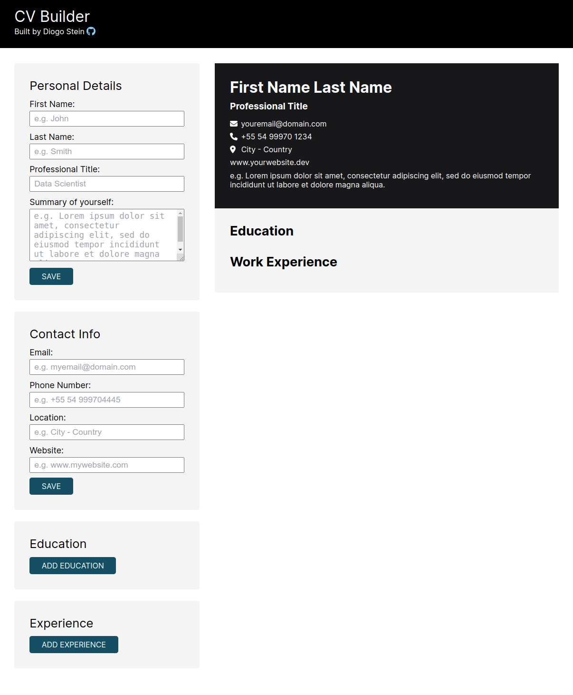

# CV Builder

This is a project for The Odin Project - React Course

## Demo

<a href="https://celadon-quokka-982195.netlify.app/" target="_blank">Click to see deployed app</a>

## Screenshot

## Learnings

Throughout the development of this React project, I gained valuable insights and skills that contributed to my growth as a developer.

I deepened my understanding of React by working with components, props, and state. This project provided hands-on experience in building efficient and reusable UI components, enhancing the overall application structure.
